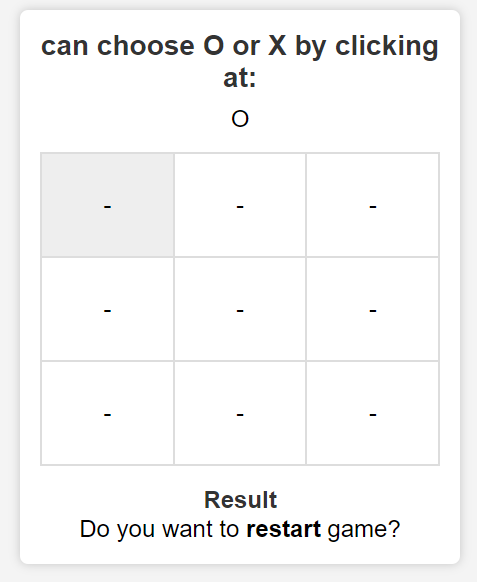

# Tic Tac Toe Game


## Overview

This is a simple implementation of the classic Tic Tac Toe game, also known as "Noughts and Crosses." It's designed to be a fun and interactive web-based game where two players can compete against each other to achieve a winning combination or a draw.

### Features

- 🎨 Modern and clean user interface.
- 🤝 Interactive gameplay for two players.
- 🔄 Player turn indicator to keep the action flowing.
- 🏆 Winning and draw conditions for a satisfying game conclusion.
- 🧩 Easy-to-understand code structure for developers.
## How to Play
Player 1 is 'X', and Player 2 is 'O.

- Take turns to click on the grid cells to place your symbol.
- The first player to form a line of three of their symbols wins!
- If the grid is filled without a winning combination, it's a draw.
## Contributing
If you'd like to contribute to this project, please follow these steps:

1. Fork this repository.
2. Create a new branch for your feature or bug fix.
3. Make your changes and commit them.
4. Push your changes to your fork.
5. Create a pull request to merge your changes into this repository.

## Getting Started

1. Clone this repository to your local machine.

   ```sh
     git clone https://github.com/your-username/tic-tac-toe-game.git

## Screenshot



